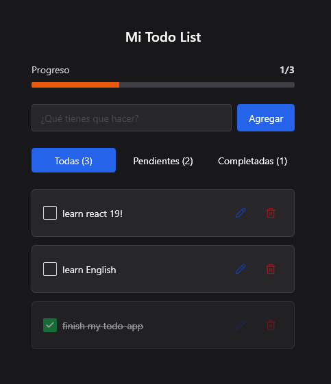
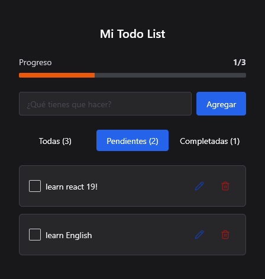
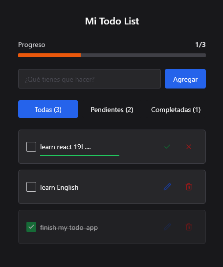
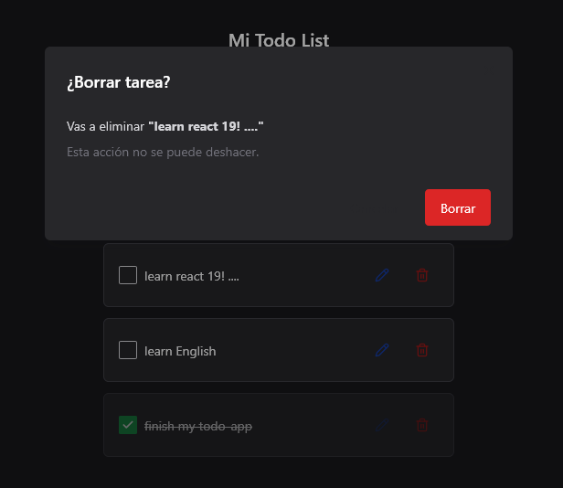

# ✅ Todo App

Aplicación de tareas moderna construida con React 18, TypeScript y Chakra UI v3.2

[](https://todo-kqs6ms0hk-miguelzac101s-projects.vercel.app/)
[](https://react.dev)
[](https://chakra-ui.com)
[](https://www.typescriptlang.org)


## ✨ Features

- **CRUD completo**: Crear, leer, actualizar y eliminar tareas
- **Filtros dinámicos**: Ver todas, activas o completadas
- **Edición inline**: Doble click o botón para editar. Guarda con Enter/Escape
- **Confirmación**: Dialog antes de borrar para evitar accidentes
- **Progreso visual**: Barra que muestra % de tareas completadas
- **Empty states**: Mensajes claros cuando no hay tareas
- **Persistencia**: Guarda automáticamente en localStorage
- **Responsive**: Se adapta a mobile y desktop
- **Dark mode**: UI optimizada para tema oscuro

## 🛠 Tech Stack

| Tecnología | Uso |
| --- | --- |
| **React 18** | UI con Hooks |
| **TypeScript** | Tipado estático |
| **Chakra UI v3.2** | Sistema de diseño + componentes |
| **Vite** | Build tool + dev server |
| **React Icons** | Iconos Lucide |

## 🚀 Quick Start

### Prerequisitos
- Node.js 18+
- npm o pnpm

### Instalación

1. Clonar repo
git clone https://github.com/MiguelZac101/todo-app.git
cd todo-app

2. Instalar dependencias
npm install

3. Correr en desarrollo
npm run dev

Abre http://localhost:5173

### Build producción

npm run build
npm run preview

## 📁 Estructura

```
src/
├── components/
│   ├── TaskItem.tsx
│   ├── TaskProgress.tsx
│   ├── FilterTabs.tsx
│   ├── EmptyState.tsx
│   └── DeleteConfirmDialog.tsx
├── types/
│   └── index.ts
├── App.tsx
└── main.tsx
```

## 🎯 Roadmap

- CRUD básico
- Filtros all/active/completed
- Confirmación al borrar
- Editar tarea inline
- [ ] Drag & drop para reordenar
- [ ] Fechas límite con date picker
- [ ] Categorías/Tags
- [ ] Sincronizar con backend

## 📝 Convenciones de Commits

Este proyecto usa [Conventional Commits](https://www.conventionalcommits.org/):

- feat: Nueva feature
- fix: Bug fix
- refactor: Mejora de código sin cambiar funcionalidad
- docs: Cambios en documentación
- style: Formato, sin cambios de código

## 🌐 Deploy

Desplegado en Vercel: [todo-app](https://todo-kqs6ms0hk-miguelzac101s-projects.vercel.app/)

[[Deploy with Vercel](https://vercel.com/button)](https://vercel.com/new/clone?repository-url=https://github.com/miguelzac101/todo-app)

## 📸 Screenshots

### Vista principal


### Filtros activos


### Editando tarea


### Dialog confirmación


## 👨‍💻 Autor

**Miguel Zack**
- GitHub: [@MiguelZac101](https://github.com/MiguelZac101)


